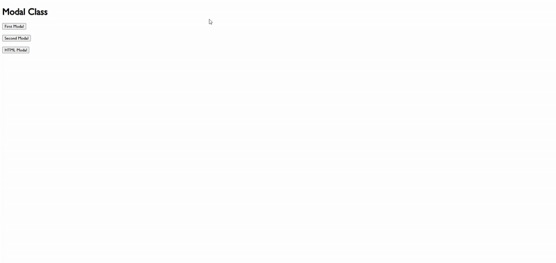

# DigitalDash

## Mission Statement

DigitalDash transforms regular walks into amazing adventures, DigitalDash's immersive virtual walking experiences enable people to travel the world and improve their well-being digitally.

## TODO List

### Navigation

- [ ] Add Logo
- [ ] Create links including call to action (Sign up).
    - [ ] Ensure they're linked to their respective URLs.
    
### Footer

- [ ] Add Logo
- [ ] Add Copyright Notice
- [ ] Add Newsletter
- [ ] Add Terms & Conditions
- [ ] Add Privacy Policy

### Database

- [ ] Change Database Configuration Settings
- [x] Add new field names for the privacy policy and terms and conditions

## User Authentication

### 🚀 Login Script

- [ ] Create PHP script to process login requests
- [ ] Validate user input (email and password)
- [ ] Check if user exists in the database
- [ ] Verify hashed password using `password_verify()`
- [ ] Store session data upon successful login
- [ ] Redirect user to `index.php` upon successful authentication
- [ ] Display error messages for incorrect login credentials
- [ ] Implement password reset functionality

### 📝 Sign-up Script

- [ ] Create PHP script to process sign-ups
- [ ] Validate email format and ensure password security
- [ ] Check if the email already exists in the database
    - [ ] If **email exists**, deny registration and prompt login
    - [ ] If **password is incorrect**, prompt for the correct password
- [ ] If email does not exist, allow user to proceed with sign-up
- [ ] Hash password using `password_hash()` before storing in the database
- [ ] Store user data securely in MySQL
- [ ] Display error messages if any validation fails

### 🚪 Sign-out Script

- [x] Create a logout mechanism using `session_destroy()` and `session_unset()`
- [x] Redirect user to the `index.html` page after signing out
- [x] Clear all stored session data upon logout

---

## HTML Boilerplate

This HTML boilerplate establishes the essential structure for a webpage. The head section sets up encoding, viewport settings, and styling through an external CSS file. Within the body, a navigation bar and footer are included, along with a placeholder for content. JavaScript files handle UI components and additional functionality, creating a scalable foundation for further development.

- Simply copy and paste it into your new `HTML` file.

```HTML
<!DOCTYPE html>

<html lang="en">

<head>
    <meta charset="UTF-8">
    <meta name="viewport" content="width=device-width, initial-scale=1.0">
    <title>DigitalDash</title>

    <link rel="stylesheet" href="https://cdnjs.cloudflare.com/ajax/libs/font-awesome/6.7.2/css/all.min.css">
    <link rel="stylesheet" href="/css/styles.css">
</head>

<body>
    <nav id="nav"></nav>

    <!--
        Add Content Here
    -->

    <footer id="footer"></footer>

    <!-- JavaScript -->
    <script src="/js/components.js"></script>
    <script src="/js/scripts.js" type="module"></script>
</body>

</html>
```

---

## Navigation and Footer Integration

> ⚠️ Note: No additional markup is required for the `<nav>` or `<footer>` elements unless explicitly modified within the component files. Any necessary changes should be handled within the respective component files for consistency and functionality.

> JavaScript will automatically insert the content into the relevant tags, so you don't need to add anything manually. Any future updates to these components will reflect across all pages, making maintence easier. Also when you do modify the component some changes may need to be made to the fallback functions within the `components.js` file.

### HTML 

```HTML
<nav id="nav"></nav>
```

```HTML
<footer id="footer"></footer>
```

### JS Script
```HTML
<script src="/js/components.js"></script>
```

---

## Modals



This guide explains how to use the `Modal` class to create dynamic modals in a web application. The `Modal` class is designed to be reusable, allowing modals to be triggered by buttons with custom content.

Heres the syntax:

```JavaScript
onclick="initModal(param1, param2)"
```

> **param1**: *A reference to the button that triggered the modal.*

> **param2**: *A structured object that can parse HTML into the modal*

---

> ⚠️ Note: It is **important** to know that the `Modal` class will not work if you do not have this line of code in your HTML page:

> ```HTML
> <script src="js/scripts.js" type="module"></script>
> ```

---

### Usage

- Pass the `this` keyword as `param1` to reference the triggering element.

- `param2` can accept either plain text or HTML content, as shown below:

```HTML
<!-- Passing Normal Text -->
<button onclick="initModal(this, 'This is normal text!')">Modal</button>
```
or

```HTML
<!-- Passing HTML --> 
<button onclick="initModal(this, '<p>This is <b>HTML</b> content!</p>')">Modal</button>
```

This enhances the flexibility and interactivity of your modal container, allowing for a more dynamic user experience.

> ⚠️ Note: If your modal needs to accommodate more content, it’s essential to follow proper coding standards for maintainability and readability.

### Using Template Literals for New Lines

To improve readability and organization, use `template literals` (backticks ``) instead of single or double quotes. Template literals preserve formatting and make HTML easier to manage.

As follows:

```HTML
<button onclick="initModal(this, `
    <h2>Modal Heading</h2>
    <p>I am a paragraph inside the modal!</p>
    <a href='#'>I am a link!</a>
`)">Open Modal</button>
```

This approach ensures a clean structure and enhances maintainability in your code.

---

<p style='text-align: center'>© 2025 DigitalDash. All rights reserved.</p>
